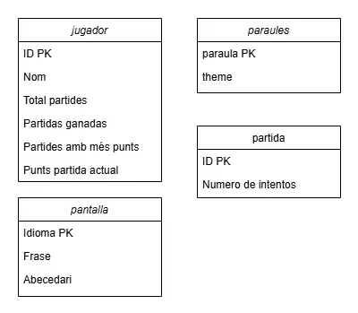
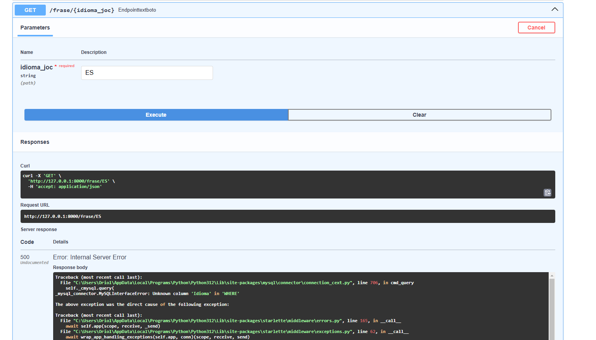
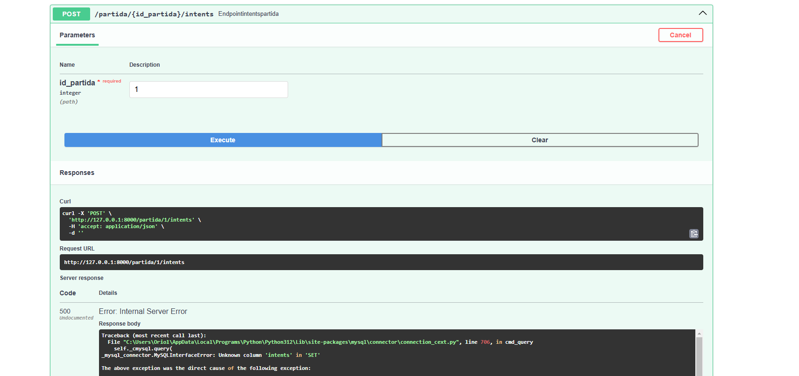
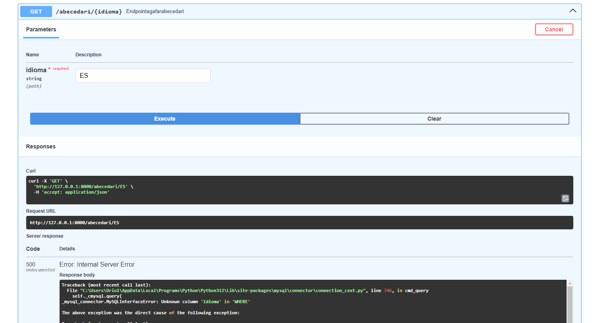
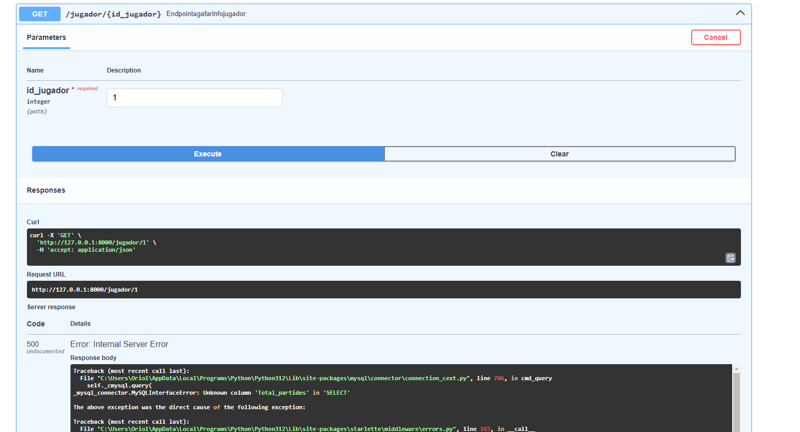
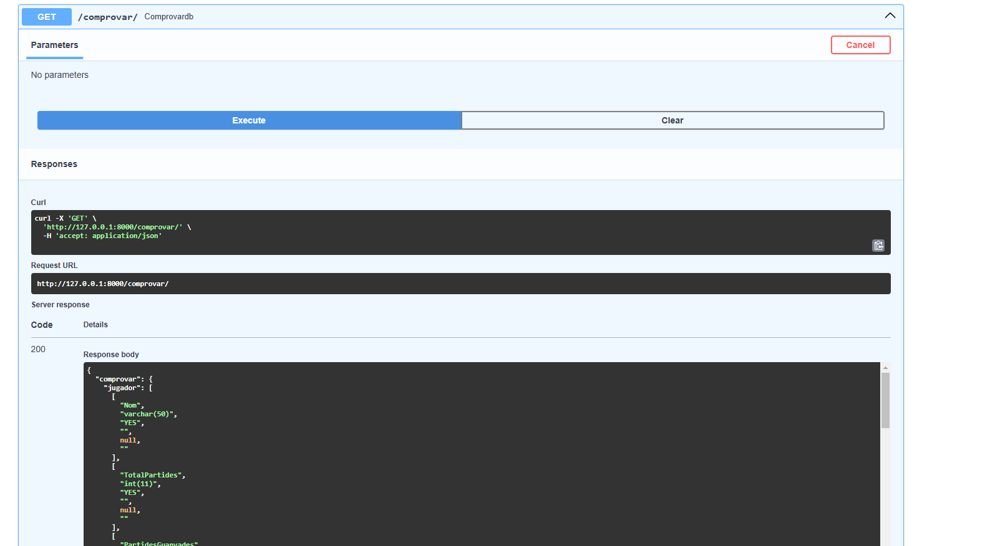

Disseny base de dades:

Get del text del boto (No he aconseguit que funcioni per un
internal error 500, diu que no exsisteix la columna Idioma,
pero si faig una query "desc pantalla" surt que exsisteix)

Post de intents a partida (No he aconseguit que funcioni 
per un internal error 500, diu que no exsisteix la columna intents,
pero si faig una query "desc partida" surt que exsisteix)

Get d'abecedari a pantalla (No he aconseguit que funcioni 
per un internal error 500, diu que no exsisteix la columna Idioma,
pero si faig una query "desc pantalla" surt que exsisteix)

Get djugador (No he aconseguit que funcioni 
per un internal error 500, diu que no exsisteix la columna Total_partides,
pero si faig una query "desc jugador" surt que exsisteix)

He fet una funcio per comprovar que si que es pogues connectar
i mostrar que les taules existeixen (a part les taules tenen valors
es a dir he posat valors no esta vuides):
[Dades retornades en comprovar el funcionament.json](Dades%20retornades%20en%20comprovar%20el%20funcionament.json)
